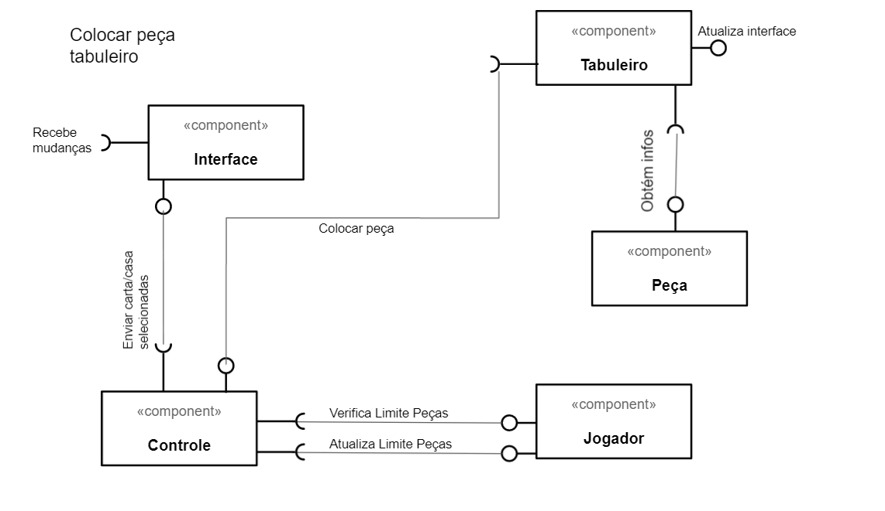

# Projeto Ether

## Descrição Resumida do Projeto/Jogo
O Ether é um jogo de tabuleiro local para dois jogadores, simulando um campo de batalha- O jogo
consiste em turnos, cada turno um jogador pode tomar uma ação com suas peças.
Ganha quem usar melhor de suas peças e estratégias para zerar a vida do oponente.

## Equipe

Renan Luis Moraes de Sousa - 243792
Vinícius Luiz Ferreira Farias - 195030

## Vídeos do Projeto

Vídeo da Prévia

[Link do vídeo](apresentação/videos)

##Slides do Projeto

[Link dos slides](apresentação/slides)

# Documentação dos Componentes

## Diagramas



O diagrama foi dividido em 3 ocasiões, quando o jogador escolhe seu deck(conjunto de cartas), quando o jogador coloca uma peça no tabuleiro e quanto um jogador mexe em uma peça.
	
Ao colocar a peça no tabuleiro, a interface envia qual peça foi escolhida e a casa escolhida, após isso, o controle "questiona" o jogador se
está dentro do limite de peças.Após isso, o controle enviar o comando para o tabuleiro colocar a peça desejada e ele(controle) atualiza a
quantia de peças do jogador. Enquanto isso, o jogador obtém as informações da peça(para ser invocada) e atualiza a interface.
	
Ao movimentar a peça, a interface manda para o controle a peça e as casas envolvidas no movimento, após isso, ele pede para o tabuleiro efetuar
o movimento, e este, pos sua vez, pede para a peça avaliar se o movimento é válido, não ou se houve combate. Se o movimento for válido, ele ocorre; se
ocorrer um combate, o controle receve o retorno do tabuleiro indicando tal, após isso,  o controle pega as peças envolvidas e resolve o combate.
	
Finalmente, ao escolher o conjunto de cartas, a interface manda o deck escolhido para o controle, este por sua vez vincula o jogador ao deck,
recebendo as informações.Após a escolha de deck, o controle fecha a tela de escolha de decks e abre o jogo principal. Observação: A ligação "obter infos"
entre o Deck e a Interface é para que as informações do deck sejam apresentadas visualmente.
	
## Componente Interface

A interface (gráfica) é o que permite o jogador interagir com o jogo, ela manda informações para o controle, para
que este resolva os comandos desejados

	
|Item  | Detalhamento	|
| ------------- | ------------- |
| Classe  | mc322.lab07.vision  |
| Autores  |  Renan |
| Interfaces | IJanelaInterativa |

## Componente Controle

O controle é como se fosse o "cérebro" do jogo, ele recebe comandos da interface e, junto com outros componentes, gera
acontecimentos no jogo. Ele funciona como um itermediário entre os componentes, preservando o encapsulamento deles.

|Item  | Detalhamento	|
| ------------- | ------------- |
| Classe  | mc322.lab07.vision  |
| Autores  |  Renan e Vinicius |
| Interfaces |  |


## Componente Peça

A peça é um componente que serve para armazenar as informações das peças, há no total 15, peças, com cada peça sendo uma
classe distinta (esta escolha permite que as cartas possuam ações especiais). Em suma, o componente peça representa as peças
do jogo.
	
|Item  | Detalhamento	|
| ------------- | ------------- |
| Classe  | mc322.lab07.model  |
| Autores  |  Renan |
| Interfaces | IPeça |


## Componente Deck

O deck guarda as combinações possíveis de peças, cada deck possui 5 peças
	
|Item  | Detalhamento	|
| ------------- | ------------- |
| Classe  | mc322.lab07.model  |
| Autores  |  Renan |
| Interfaces |  |

## Componente Jogador
	
O componente jogador é responsável por guardar as informações de cada jogador, tais quais as peças que este possui para usar,
a quantia de peças restantes, a vida , etc.
	

|Item  | Detalhamento	|
| ------------- | ------------- |
| Classe  | mc322.lab07.model  |
| Autores  |  Vinicius |
| Interfaces |  |

## Componente Tabuleiro
	
O tabuleiro é responsável por guardar a posição das peças, além de receber chamadas de movimento do controle e "perguntar" a peça
como prosseguir.
	
|Item  | Detalhamento	|
| ------------- | ------------- |
| Classe  | mc322.lab07.model  |
| Autores  |  Vinicius |
| Interfaces |  |


# Detalhamento das interfaces

##Interface IPeca

A função desta interface é garantir que todas as peças possuam funcionalidades mínimas
	
```
	
	
public interface IPeca {
	public int atacar();
	public int validarMovimento();
	public int gerarPeca();
}

	
```
	
|Método  | Detalhamento	|
| ------------- | ------------- |
| ataque  | Quando ocorre um ataque envolvendo esta peça, este método é chamado, garantindo que os efeitos do combate sejam devidamente aplicados à peça, além da ativação de efeitos   |
| validarMovimento  | Verifica se um movimento solicitado é: Válido, Invalo ou contitui um combate, dependendo de como a peça se comporta |
| gerarPeca | Este método permite colocar a peça da mão no tabuleiro  |

##Interface IJLabelInterativa

	A função desta interface é adaptar JLabels, fazer com que elas sejam responsívais ao mouse
	
```
	
	
public interface IJlabelInterativa {
		
	public void tornarInterativa();
	
	
}
	
``` 
	
|Método  | Detalhamento	|
| ------------- | ------------- |
| tornarInterativa  | O componente que chamar este método tera um Mouse listener, responsável por torna-lo responsivo ao usuário   |


# Plano de Exceções