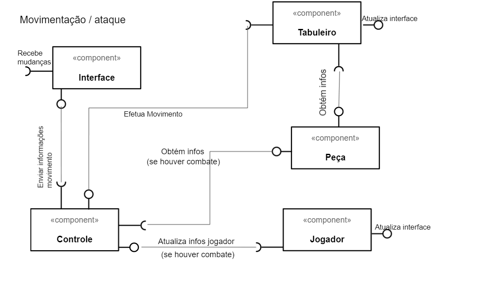
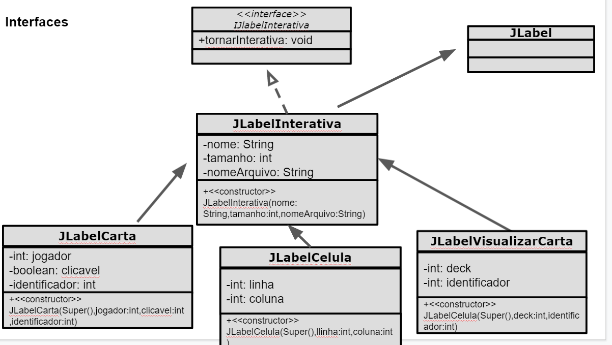
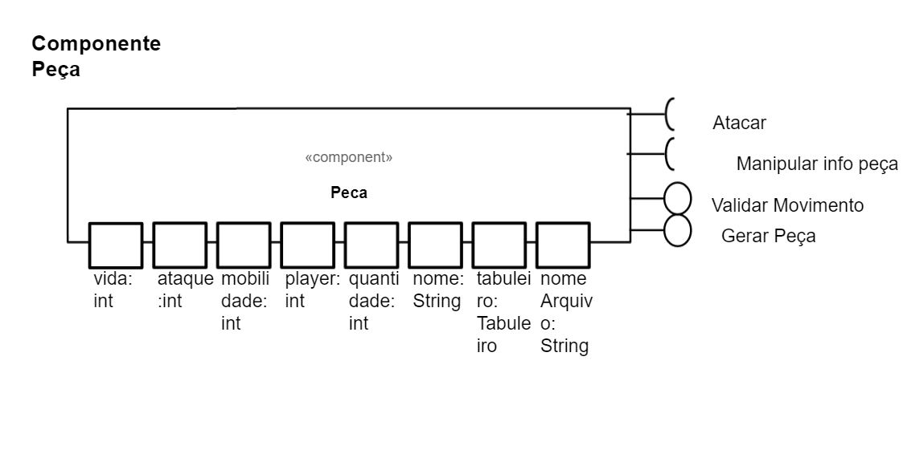
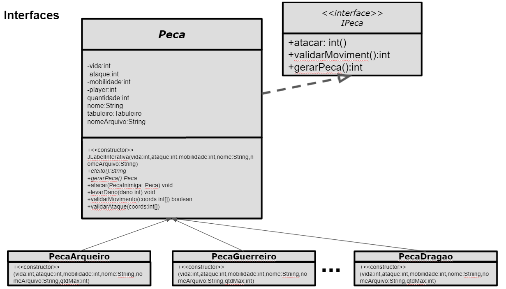
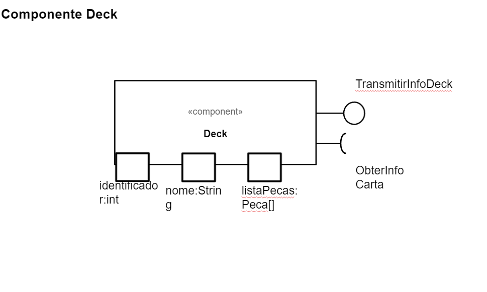
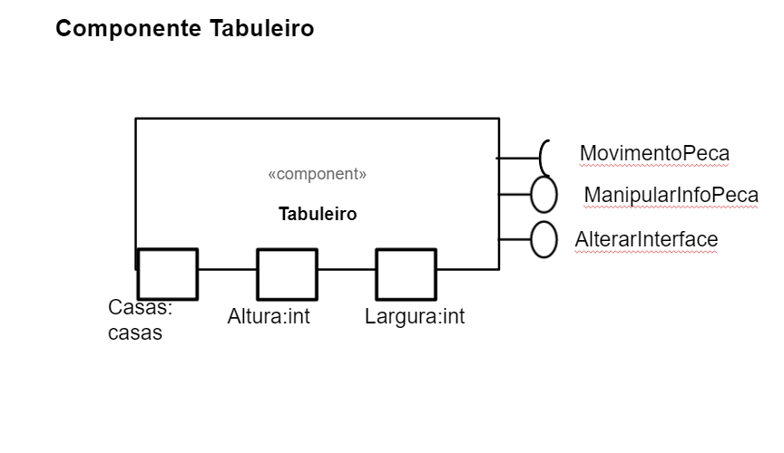

# Projeto Ether

## Descrição Resumida do Projeto/Jogo
O Ether é um jogo de tabuleiro local para dois jogadores, simulando um campo de batalha- O jogo
consiste em turnos, cada turno um jogador pode tomar uma ação com suas peças.
Ganha quem usar melhor de suas peças e estratégias para zerar a vida do oponente.

## Equipe

Renan Luis Moraes de Sousa - 243792

Vinícius Luiz Ferreira Farias - 195030

## Vídeos do Projeto

Vídeo da Prévia

[Link do vídeo](apresentação/videos)

Vídeo do Jogo

## Slides do Projeto

Slides da previa

[Link dos slides](apresentação/slides)

Slides da Apresentação Final

## Relatório de Evolução

Quanto as regras e complexidade do jogo houveram algumas melhorias:
*Não seria possível os jogadores escolherem suas próprias cartas, elas seriam previamente fornecidas. Porém, na versão final, cada jogador escolhe seu conjunto de cartas.
*As peças se moveriam apenas na horizontal e na vertical. Agora, elas se movem em uma área.
*O combate ocorria apenas à curtas distâncias e as peças envolvidas deveriam se colidir durante o movimento. Na versão final as peças podem escolher atacar quando estão próximas, além de o ataque à distância ser uma mecânica implementada em algumas peças.
*A princípio, as cartas diferiam apenas em seus atributos; agora, algumas cartas possuem efeitos especiais únicos.

Quanto a interação do usuário com o jogo- interface gráfica:
*Em um primeiro momento era suporto que os comandos do usuário fossem passados via um console, porém, foi implementada uma interface gráfica interativa e responsiva, na qual os jogadores conseguem facilmente jogar.
*Quando foi decidido usar a interface gráfica, esperava-se usar botões como mecanismo de comunicação com o usuário, porém, testes prévios indicaram que uma quantidade elevada de botões (seriam 400) poderia fazer com que o jogo demorasse para carregar, então, os componentes gráficos foram implementados de forma customizada para suprir as necessidades do programa.
*Na versão final, a interface proporciona um feedback para algumas ações do mouse dos jogadores, como por exemplo: fornecer informações sobre as peças quando o mouse é passado sobre elas.
*Outro ponto é que na versão final, diferente dos protótipos, é possível jogar novamente sem reabrir o jogo.

Quanto ao código,arquitetura e organização:
*Algumas conexões desnecessárias entre os componente foram removidas, o que foi benéfico.
*Algumas interações que ocorriam na interface (feedback para o usuário) antes dependiam intimamente de métodos do controle, agora, apenas métodos da interface são necessários.
*As peças tem mais autonomia, são responsáveis pelo seu movimento e combate.
*Foram adicionadas algumas interfaces para manter o padrão de conexão entre alguns componentes.

# Destaques de Código

## Destaque 01

Este trecho foi usado na tela de escolha de cartas, cada método gera uma parte do interface gráfica, permitindo a reciclagem de código, além de uma organização melhor do layout, pois é possível transladar os componentes gerados

```

		public ScreenSelecaoDeck(...) {
			
		
	...


			gerarFundo();
			gerarInfos(-50,0);
			gerarCartas(450,150,deck0);
			gerarCartas(450,400,deck1);
			gerarCartas(450,650,deck2);
	...
		}


```

## Destaque 02

Este método no controle permitia sempre que desejado, atualizar parte da interface gráfica que dependia das informações contidas nele(controle) sem que fosse necessário atualizar a interface gráfica inteira

```
...
    public void atualizarScoreboardInGame() {
       	this.screenInGame.atualizarScoreboard(jogadores[0].getVida(), jogadores[1].getVida(), this.turno);
    }
...
	
```


## Destaaque 03

Este método transforma a carta na mão do jogador de uma imagem em um componente interativo, por meio de um mouse listener.

```

	public void tornarInterativa() {
		
		...
			
			public void mouseReleased(MouseEvent e) {
				if(clicavel) {
				int[] coord = {jogador,identificador};
				controle.cartaSelecionada(coord);
				}
			}

			public void mouseEntered(MouseEvent arg0) {
				
				ICarta peca = controle.getJogador(jogador).getDeck().getCartaLista(identificador);
				janelaMae.alterarSelecionada((Peca)peca);

			}


		...	
		
	}

```

## Destaque 04

Embora bem simples, esta função usa de polimorfismo(janela não é necessáriamente um JFrame, pode ser herdeiro) para ativar uma janela que estava inativa. Ela facilida o gerenciamento por parte do controle, sendo responsável por iniciar o "View"

```

    public void abrirJanela(JFrame janela) {
    	janela.setVisible(true);
    }

```


## Destaque 05

```

Este método causa a troca de turnos e todas as suas consequências

    private void trocarJogadorAtual(){
        if(!jogadores[0].vivo() || !jogadores[1].vivo()){
            acabarJogo();
        }
        this.numeroPAtual = getOtherPlayer();
        this.tipoAcaoAnterior = -1;
        incrementarTurno();
        atualizarScoreboardInGame();
        System.out.println("JOGADOR ATUAL:" +numeroPAtual);
        //tabuleiro.mostrarNoTerminal();
    }

```

# Destaques do Pattern

## Destaque 1

Este padrão mostra de forma muito clara a parte da arquitetura Model-View-Controler:
A interface indica para o controle qual peça deve ser colocada e a casa na qual ela deve ser colocada, após isso, o controle envia para o tabuleiro essas informações e ele (tabuleiro) avalia se é um comando válido, se sim, ele atualiza sua matriz de peças e retorna para o controle que houve mudança, o qual atualizará apenas as casas envolvidas.
Este modelo no qual o controle recebe o retorno de um model e atualiza a interface com base nele torna muito menor a interdependência entre o Model e o View e centraliza a comunicação entre as 3 partes da arquitetura.

```

    public boolean colocarPeca(int numeroCarta,int[] coordenadas){
	
	...
        ICarta tipoDePeca = jogador.getCarta(numeroCarta);
        if(tabuleiro.colocarPeca(tipoDePeca,coordenadas,numeroPAtual)){
            jogador.atualizarNumeroPecas(numeroCarta);
            trocarJogadorAtual();
        }else{
            return false;
        }
		
		
        this.screenInGame.atualizarCasaTabuleiroVisual(coordenadas[0], coordenadas[1]);
        return true;


    }

```


## Destaque 2
Anologamente ao destaque 1, este método no controle é chamado de forma indireta pela interface. Novamente é possível ver a interação com o Model (tabuleiro) e o controle. Este destaque é para reforçar em como a abordagem deste tipo de arquitetura foi utilizada e em como ela facilitou a comunicação de componentes.


```

    public void moverPeca(int[] coords1,int[] coords2){
        if(tabuleiro.moverPeca(coords1, coords2)){
            if(tabuleiro.deveSerSacrificada(coords2)){
                sacrificarPeca(tabuleiro.pecaAt(coords2),jogadores[getOtherPlayer()]);
            }
            this.screenInGame.atualizarCasaTabuleiroVisual(coords1[0], coords1[1]);
            this.screenInGame.atualizarCasaTabuleiroVisual(coords2[0], coords2[1]);
            trocarJogadorAtual();
        }
    }

```

## Destaque 3
O controle consegue acessar parte dos componentes do Model,e trocar informações entre Model e View. Isso permite que a troca de informações entre ambos seja feita de forma a minimizar a dependência entre eles e facilitar a implementação.

```
    public void atualizarScoreboardInGame() {
       	this.screenInGame.atualizarScoreboard(jogadores[0].getVida(), jogadores[1].getVida(), this.turno);
    }

```

# Conclusões e Trabalhos Futuros

Acreditamos que este projeto não foi apenas importante para testar nossos conhecimentos, mas também para evoluir a nossa capacidade de desenvolver grandes projetos em equipe. 
Com relação ao tempo, gostariamos de ter adicionado mais cartas e mais interações no tabuleiro para tornar o jogo mais divertido, além disso, gostariamos de ter colocado mais interfaces para facilitar a expansão do programa. Ademais, há techos de códigos que podem ser escritos em menos linhas

# Documentação dos Componentes

## Diagramas





O diagrama foi dividido em 3 ocasiões, quando o jogador escolhe seu deck(conjunto de cartas), quando o jogador coloca uma peça no tabuleiro e quanto um jogador mexe em uma peça.
	
Ao colocar a peça no tabuleiro, a interface envia qual peça foi escolhida e a casa escolhida, após isso, o controle "questiona" o jogador se
está dentro do limite de peças.Após isso, o controle enviar o comando para o tabuleiro colocar a peça desejada e ele(controle) atualiza a
quantia de peças do jogador. Enquanto isso, o jogador obtém as informações da peça(para ser invocada) e atualiza a interface.
	
Ao movimentar a peça, a interface manda para o controle a peça e as casas envolvidas no movimento, após isso, ele pede para o tabuleiro efetuar
o movimento, e este, pos sua vez, pede para a peça avaliar se o movimento é válido, não ou se houve combate. Se o movimento for válido, ele ocorre; se
ocorrer um combate, o controle receve o retorno do tabuleiro indicando tal, após isso,  o controle pega as peças envolvidas e resolve o combate.
	
Finalmente, ao escolher o conjunto de cartas, a interface manda o deck escolhido para o controle, este por sua vez vincula o jogador ao deck,
recebendo as informações.Após a escolha de deck, o controle fecha a tela de escolha de decks e abre o jogo principal. Observação: A ligação "obter infos"
entre o Deck e a Interface é para que as informações do deck sejam apresentadas visualmente.
	
## Componente Interface




A interface (gráfica) é o que permite o jogador interagir com o jogo, ela manda informações para o controle, para
que este resolva os comandos desejados

	
|Item  | Detalhamento	|
| ------------- | ------------- |
| Classe  | mc322.lab07.vision  |
| Autores  |  Renan |
| Interfaces | IJanelaInterativa |

## Componente Controle


O controle é como se fosse o "cérebro" do jogo, ele recebe comandos da interface e, junto com outros componentes, gera
acontecimentos no jogo. Ele funciona como um itermediário entre os componentes, preservando o encapsulamento deles.

|Item  | Detalhamento	|
| ------------- | ------------- |
| Classe  | mc322.lab07.vision  |
| Autores  |  Renan e Vinicius |
| Interfaces |  |


## Componente Peça





A peça é um componente que serve para armazenar as informações das peças, há no total 15, peças, com cada peça sendo uma
classe distinta (esta escolha permite que as cartas possuam ações especiais). Em suma, o componente peça representa as peças
do jogo.
	
|Item  | Detalhamento	|
| ------------- | ------------- |
| Classe  | mc322.lab07.model  |
| Autores  |  Renan |
| Interfaces | IPeça |


## Componente Deck



O deck guarda as combinações possíveis de peças, cada deck possui 5 peças
	
|Item  | Detalhamento	|
| ------------- | ------------- |
| Classe  | mc322.lab07.model  |
| Autores  |  Renan |
| Interfaces |  |

## Componente Jogador
	

	
O componente jogador é responsável por guardar as informações de cada jogador, tais quais as peças que este possui para usar,
a quantia de peças restantes, a vida , etc.
	

|Item  | Detalhamento	|
| ------------- | ------------- |
| Classe  | mc322.lab07.model  |
| Autores  |  Vinicius |
| Interfaces |  |

## Componente Tabuleiro
	

	
O tabuleiro é responsável por guardar a posição das peças, além de receber chamadas de movimento do controle e "perguntar" a peça
como prosseguir.
	
|Item  | Detalhamento	|
| ------------- | ------------- |
| Classe  | mc322.lab07.model  |
| Autores  |  Vinicius |
| Interfaces |  |


# Detalhamento das interfaces


## Interface IPeca


A função desta interface é garantir que todas as peças possuam funcionalidades mínimas
	
```
	
	
public interface IPeca {
	public int atacar();
	public int validarMovimento();
	public int gerarPeca();
}

	
```
	
|Método  | Detalhamento	|
| ------------- | ------------- |
| ataque  | Quando ocorre um ataque envolvendo esta peça, este método é chamado, garantindo que os efeitos do combate sejam devidamente aplicados à peça, além da ativação de efeitos   |
| validarMovimento  | Verifica se um movimento solicitado é: Válido, Invalo ou contitui um combate, dependendo de como a peça se comporta |
| gerarPeca | Este método permite colocar a peça da mão no tabuleiro  |

## Interface IJLabelInterativa

A função desta interface é adaptar JLabels, fazer com que elas sejam responsívais ao mouse
	
```
	
	
public interface IJlabelInterativa {
		
	public void tornarInterativa();
	
	
}
	
``` 
	
|Método  | Detalhamento	|
| ------------- | ------------- |
| tornarInterativa  | O componente que chamar este método tera um Mouse listener, responsável por torna-lo responsivo ao usuário   |


# Plano de Exceções


|Método  | Detalhamento	|
| ------------- | ------------- |
| ExcecaoModelo  | Houve algum erro na seção interface-usuário, causada ou não por uma interação do usuário|
| SelecaoInvalida  | O usuário selecionou alguma casa invalida|
| PecaDoOponente | O usuario selecionou uma peca do oponente para controlar, o que não pode|
| NaoHaPecaNaCasa  | O usuario tentou dar comandos a uma peça que não existe, pois a célula alvo era vazia|
| InformacoesIncompletas  | Alguma caracteristica das peças não foram devidamente carregadas|
| ValoresInexistentes  | Algum atributo da peça está nulo |
| FotoInexistente  | A imagem que representa a peça não foi encontrada nos arquivos do jogo|
